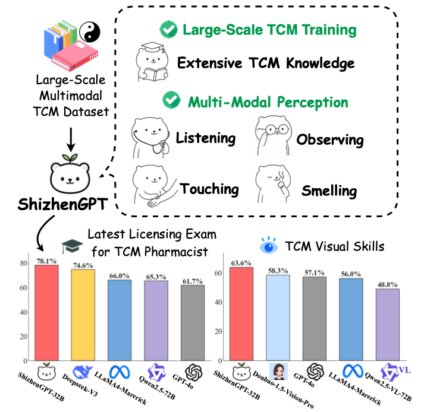

# Towards Multimodal LLMs for Traditional Chinese Medicine

<div align="center">
<h3>
  ShizhenGPT
</h3>
</div>

<div align="center">
<h4>
  📃 <a href="https://arxiv.org/abs/2508.14706" target="_blank">Paper</a> ｜ 📚 <a href="FreedomIntelligence/TCM-Pretrain-Data-ShizhenGPT" target="_blank">TCM Pre-training Dataset</a> | 📚 <a href="FreedomIntelligence/TCM-Instruction-Tuning-ShizhenGPT" target="_blank">TCM Instruction Data</a>
</h4>
  <h4>
  🤗 <a href="https://huggingface.co/FreedomIntelligence/ShizhenGPT-7B-Omni" target="_blank">ShizhenGPT-7B</a> | 🤗 <a href="https://huggingface.co/FreedomIntelligence/ShizhenGPT-32B-VL" target="_blank">ShizhenGPT-32B</a>
</h4>
</div>

## ⚡ Introduction
Hello! Welcome to the repository for [ShizhenGPT](https://arxiv.org/abs/2508.14706)! 

<div align=center>

</div>

**ShizhenGPT** is the first multimodal LLM designed for Traditional Chinese Medicine (TCM). Trained extensively, it excels in TCM knowledge and can understand images, sounds, smells, and pulses (望闻问切).

## 📚 The Largest Open-Source TCM Dataset

We open-source the largest available TCM dataset, consisting of a pretraining dataset and an instruction fine-tuning dataset.

|                             | Quantity    | Description                                                                                       | Download Link                                                                                                                                  |
| --------------------------- | ----------- | ------------------------------------------------------------------------------------------------- | ---------------------------------------------------------------------------------------------------------------------------------------------- |
| **TCM Pretraining Dataset** | \~6B tokens | Injects TCM knowledge and aligns visual and auditory understanding. | [FreedomIntelligence/TCM-Pretrain-Data-ShizhenGPT](https://huggingface.co/datasets/FreedomIntelligence/TCM-Pretrain-Data-ShizhenGPT)           |
| **TCM Instruction Dataset** | 27K items   | Fine-tunes TCM LLMs to improve instruction-following and response quality.  | [FreedomIntelligence/TCM-Instruction-Tuning-ShizhenGPT](https://huggingface.co/datasets/FreedomIntelligence/TCM-Instruction-Tuning-ShizhenGPT) |

## 👨‍⚕️ Model

#### Model Access

> **ShizhenGPT-7B** is available on Huggingface:

|                        | Parameters | Supported Modalities          | Link                                                                  |
| ---------------------- | ---------- | ----------------------------- | --------------------------------------------------------------------- |
| **ShizhenGPT-7B-LLM**  | 7B         | Text                          | [HF Link](https://huggingface.co/FreedomIntelligence/ShizhenGPT-7B-LLM) |
| **ShizhenGPT-7B-VL**   | 7B         | Text, Image Understanding     | [HF Link](https://huggingface.co/FreedomIntelligence/ShizhenGPT-7B-VL) |
| **ShizhenGPT-7B-Omni** | 7B         | Text, Four Diagnostics (望闻问切) | [HF Link](https://huggingface.co/FreedomIntelligence/ShizhenGPT-7B-Omni) |
| **ShizhenGPT-32B-LLM**  | 32B        | Text                          | [HF Link](https://huggingface.co/FreedomIntelligence/ShizhenGPT-32B-LLM) |
| **ShizhenGPT-32B-VL**   | 32B        | Text, Image Understanding     | [HF Link](https://huggingface.co/FreedomIntelligence/ShizhenGPT-32B-VL) |
| **ShizhenGPT-32B-Omni** | 32B        | Text, Four Diagnostics (望闻问切) | Available soon                                                          |

*Note: The LLM and VL models are parameter-split variants of ShizhenGPT-7B-Omni. Since their architectures align with Qwen2.5 and Qwen2.5-VL, they are easier to adapt to different environments. In contrast, ShizhenGPT-7B-Omni requires `transformers==0.51.0`.*


#### Model Inference


## 🚀 Training


## 🧐 Evaluation


## 📖 Citation
```
@misc{chen2025shizhengptmultimodalllmstraditional,
      title={ShizhenGPT: Towards Multimodal LLMs for Traditional Chinese Medicine}, 
      author={Junying Chen and Zhenyang Cai and Zhiheng Liu and Yunjin Yang and Rongsheng Wang and Qingying Xiao and Xiangyi Feng and Zhan Su and Jing Guo and Xiang Wan and Guangjun Yu and Haizhou Li and Benyou Wang},
      year={2025},
      eprint={2508.14706},
      archivePrefix={arXiv},
      primaryClass={cs.CL},
      url={https://arxiv.org/abs/2508.14706},
}
```